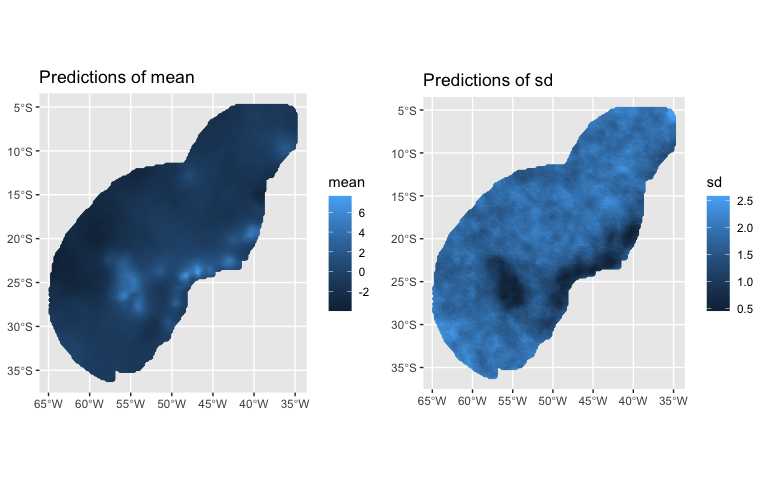

<!-- README.md is generated from README.Rmd. Please edit that file -->

# PointedSDMs

<!-- badges: start -->

[](https://github.com/PhilipMostert/PointedSDMs/actions/workflows/R-CMD-check.yaml)
[](https://app.codecov.io/gh/PhilipMostert/PointedSDMs?branch=ChangingToR6)
[](https://zenodo.org/badge/latestdoi/368823136)

<!-- badges: end -->

The goal of *PointedSDMs* is to simplify the construction of integrated
species distribution models (ISDMs) for large collections of
heterogeneous data. It does so by building wrapper functions around
[inlabru](https://besjournals.onlinelibrary.wiley.com/doi/abs/10.1111/2041-210X.13168),
which uses the [INLA
methodology](https://rss.onlinelibrary.wiley.com/doi/abs/10.1111/j.1467-9868.2008.00700.x)
to estimate a class of latent Gaussian models.

## Installation

You can install the development version of PointedSDMs from
[GitHub](https://github.com/) with:

``` r
# install.packages("devtools")
devtools::install_github("PhilipMostert/PointedSDMs")
```

or directly through CRAN using:

``` r
install.packages('PointedSDMs')
```

## Package functionality

*PointedSDMs* includes a selection of functions used to streamline the
construction of ISDMs as well and perform model cross-validation. The
core functions of the package are:

| Function name  | Function description                                                                                          |
|----------------|---------------------------------------------------------------------------------------------------------------|
| `intModel()`   | Initialize and specify the components used in the integrated model.                                           |
| `blockedCV()`  | Perform spatial blocked cross-validation.                                                                     |
| `fitISDM()`    | Estimate and preform inference on the integrated model.                                                       |
| `datasetOut()` | Perform dataset-out cross-validation, which calculates the impact individual datasets have on the full model. |

The function `intModel()` produces an [R6](https://github.com/r-lib/R6)
object, and as a result there are various *slot functions* available to
further specify the components of the model. These *slot functions*
include:

| `intModel()` slot function   | Function description                                                                                                                                            |
|------------------------------|-----------------------------------------------------------------------------------------------------------------------------------------------------------------|
| `` `.$plot()` ``             | Used to create a plot of the available data. The output of this function is an object of class [`gg`](https://github.com/tidyverse/ggplot2).                    |
| `` `.$addBias()` ``          | Add an additional spatial field to a dataset to account for sampling bias in unstructured datasets.                                                             |
| `` `.$updateFormula()` ``    | Used to update a formula for a process. The idea is to start specify the full model with `intModel()`, and then thin components per dataset with this function. |
| `` `.$updateComponents()` `` | Change or add new components used by [inlabru](https://besjournals.onlinelibrary.wiley.com/doi/abs/10.1111/2041-210X.13168) in the integrated model.            |
| `` `.$priorsFixed()` ``      | Change the specification of the prior distribution for the fixed effects in the model.                                                                          |
| `` `.$specifySpatial()` ``   | Specify the spatial field in the model using penalizing complexity (PC) priors.                                                                                 |
| `` `.$spatialBlock()` ``     | Used to specify how the points are spatially blocked. Spatial cross-validation is subsequently performed using `blockedCV()`.                                   |
| `` `.$addSamplers()` ``      | Function to add an integration domain for the PO datasets.                                                                                                      |

## Example

This is a basic example which shows you how to specify and run an
integrated model, using three disparate datasets containing locations of
the solitary tinamou (*Tinamus solitarius)*.

``` r

library(PointedSDMs)
library(ggplot2)
library(terra)
```

``` r

bru_options_set(inla.mode = "experimental")

#Load data in

data("SolitaryTinamou")

projection <- "+proj=longlat +ellps=WGS84"

species <- SolitaryTinamou$datasets

NPP <- scale(terra::rast(system.file('extdata/SolitaryTinamouCovariates.tif', 
                                      package = "PointedSDMs"))$NPP)

mesh <- SolitaryTinamou$mesh
```

Setting up the model is done easily with `intModel()`, where we specify
the required components of the model:

``` r

#Specify model -- here we run a model with one spatial covariate and a shared spatial field

model <- intModel(species, spatialCovariates = NPP, Coordinates = c('X', 'Y'),
                 Projection = projection, Mesh = mesh, responsePA = 'Present')
```

We can also make a quick plot of where the species are located using
`` `.$plot()` ``:

``` r

region <- SolitaryTinamou$region

model$plot(Boundary = FALSE) + 
  geom_sf(data = st_boundary(region))
```


We can then estimate the parameters in the model using the `fitISDM()`
function:

``` r

#Run the integrated model

modelRun <- fitISDM(model, options = list(control.inla = list(int.strategy = 'eb'), 
                                          safe = TRUE))
#> 
#>  *** inla.core.safe:  rerun to try to solve negative eigenvalue(s) in the Hessian
summary(modelRun)
#> Summary of 'bruSDM' object:
#> 
#> inlabru version: 2.8.0
#> INLA version: 23.06.29
#> 
#> Types of data modelled:
#>                                     
#> eBird                   Present only
#> Parks                Present absence
#> Gbif                    Present only
#> Time used:
#>     Pre = 0.633, Running = 25.4, Post = 0.0346, Total = 26.1 
#> Fixed effects:
#>                   mean    sd 0.025quant 0.5quant 0.975quant   mode kld
#> NPP              0.004 0.008     -0.011    0.004      0.019  0.004   0
#> eBird_intercept  0.004 0.006     -0.007    0.004      0.015  0.004   0
#> Parks_intercept -0.681 0.342     -1.351   -0.681     -0.011 -0.681   0
#> Gbif_intercept  -0.020 0.012     -0.044   -0.020      0.004 -0.020   0
#> 
#> Random effects:
#>   Name     Model
#>     shared_spatial SPDE2 model
#> 
#> Model hyperparameters:
#>                            mean    sd 0.025quant 0.5quant 0.975quant  mode
#> Theta1 for shared_spatial -4.70 0.000      -4.70    -4.70      -4.70 -4.70
#> Theta2 for shared_spatial -2.42 0.001      -2.42    -2.42      -2.42 -2.42
#> 
#> Deviance Information Criterion (DIC) ...............: 28478.88
#> Deviance Information Criterion (DIC, saturated) ....: NA
#> Effective number of parameters .....................: 13077.42
#> 
#> Watanabe-Akaike information criterion (WAIC) ...: 91246.11
#> Effective number of parameters .................: 43157.68
#> 
#> Marginal log-Likelihood:  -3289.18 
#>  is computed 
#> Posterior summaries for the linear predictor and the fitted values are computed
#> (Posterior marginals needs also 'control.compute=list(return.marginals.predictor=TRUE)')
```

*PointedSDMs* also includes generic predict and plot functions:

``` r

predictions <- predict(modelRun, mesh = mesh,
                       mask = region, 
                       spatial = TRUE,
                       fun = 'linear')

plot(predictions)
```


